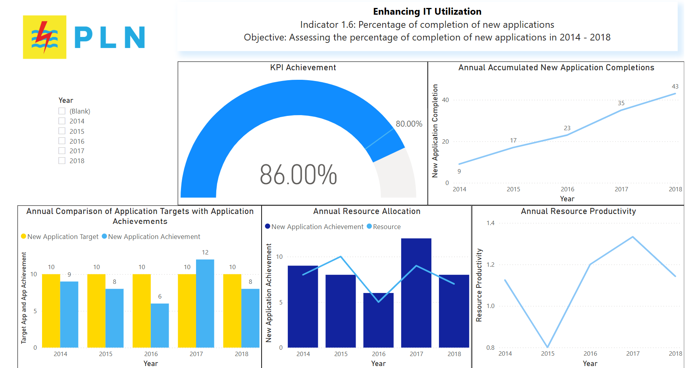

# Enhancing IT Utilization – PT PLN (Dummy Data)

This Power BI dashboard was created to visualize and evaluate IT performance metrics using *dummy data* inspired by PT PLN's IT operations from 2014 to 2018. It highlights key indicators such as uptime, infrastructure reliability, and application implementation progress.

## Overview

The dashboard tracks and visualizes:
- Annual uptime and downtime for applications, databases, and infrastructure
- New application completions vs targets
- KPI achievements and IT resource allocation
- Trends across multiple years with interactive filtering

## Objectives

- Simulate analysis of IT utilization and service availability
- Demonstrate dashboard design and storytelling with Power BI
- Showcase ability to model and visualize key IT KPIs

## Key Features

- *Application Uptime vs Target*
- *Network & Infrastructure Uptime Analysis*
- *Database Availability Metrics*
- *New Application Completion Tracking*
- *KPI Performance Ratios*
- Interactive filters by year and month

## Tools Used

- Power BI Desktop
- DAX (Calculated Measures)
- Data Modeling
- Custom Visual Design

## Preview

## Live Dashboard

[View Interactive Dashboard](https://intip.in/EnhancingITDashboard)

## Disclaimer

*This project uses dummy data* and is intended for portfolio and demonstration purposes only. It does not represent actual operational data or insights from PT PLN.

## License
Open for educational and non-commercial use.
